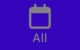

# Food app

## Main screen

### Overview
The One-day entries is the main screen. First screen to show when user opens the app. It will display food entries logged by the user.

On top of the screen, just beneath the device status bar is the header which the in the middle shows the date picked by the user dynamically. On the right side of the header is a button with a "+" icon that allow user to add a new food entry. 

Under the header is a calendar that user can click on a specific day to show food entries for that day. In the above example, the device contains entries of different dates and only "Salmon" and "White Rice" entry are shown as their date is 2024-11-22, the date user picked.

Between the calendar and the bottom tab is the where the entries sit on. A summary that sums up calories of all food entries on that day is shown. Each individual entry contains the description, date, and the calories. If the description is too long, it will be trimmed and appended with "..." to prevent overflow. The full description of the first entry is "Salmon too long abcdefghijk" and it's shown as "Salmon too long abcd...". The calories part is aligned to the calories summary to provide better viewing experience

The undermost component is the bottom tab, which will be the main component to navigate through different screens in this app.

### Picking date

There are different ways to navigates through dates. First one being clicking 1 single day out of 28-31 days shown for 1 month. To navigate to different months, click on the "<" icon to the previous month or ">" to the next month. To quickly jump to a month or a year, click the month or year shown in the calender and the available months or years will be shown for choosing. The selected day/month/year are in an accent color, in this case a gold/yellow color to stand out from the purple theme.

### No entry

If no entry was logged that day, there will be fallback text saying "No food entry for [DATE]". Of course the date of this fallback text is dynamic just like the header and corresponds to which day the user picks.

### Scrolling

If there are more entries than what can be shown one at a time, user can scroll up and down to see them.

### Bottom tab

Like in the calendar, the currently active screen will be in a accent color. Moreover, the icon for active and inactive is different. The inactive icon is a calender with empty design while the active icon is a calender with a block of one day to highlight to user "this is the screen for one day's entry, not one week or month".

## All entries

### Overview

The all entries screen is a simplified version of the main screen which shows all food entries of the user.

The header is similar but instead of a date and hard coded "All Entries" is shown. The rightside "+" button remains the same for adding a new food entry. The calendar is gone as it is not useful for all entries. Summary is also not a part of this screen. Showing calories summary for every entries logged to the device is not meaningful since we assume majority of users focus on how much they ate in one day and the TDEE (Total Daily Energy Expenditure) rather than how much they ate throughout a longer period.

Scrolling is available when the amount of entries exceed the screen.

### Bottom tab

Same design philosophy as the main screen. But this time the active icon is a calendar with grid design, highlighting it's all instead of just one
